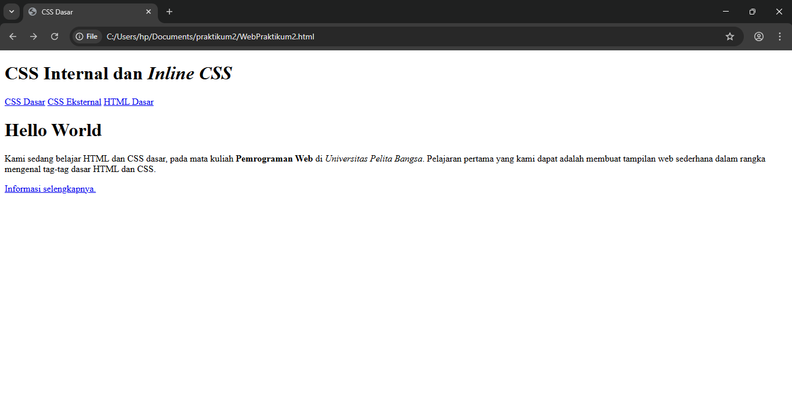
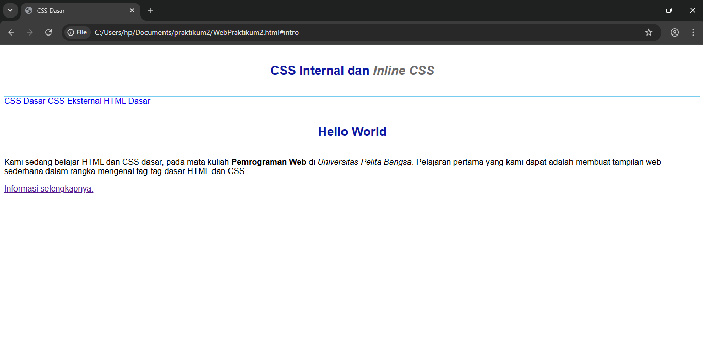
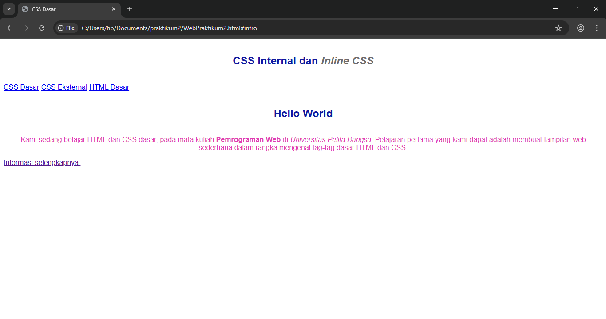
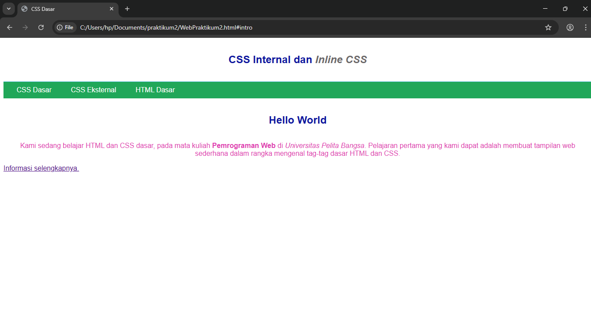
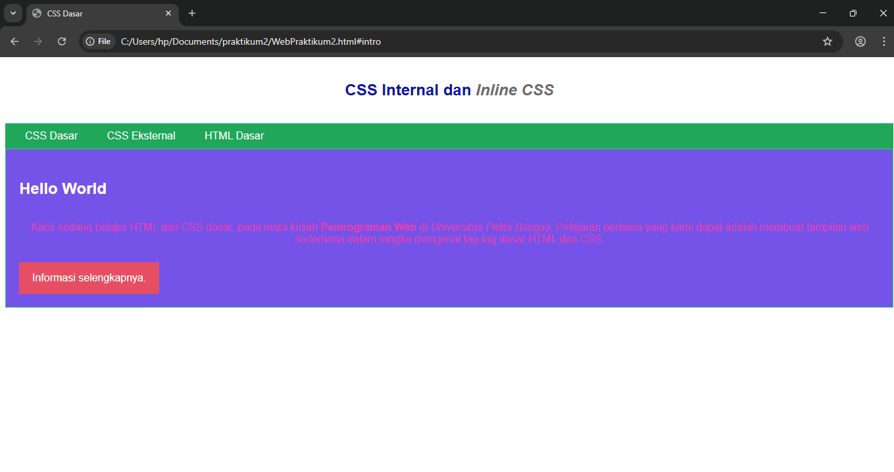

# Lab2Web
<p>Nama: Sayyid Sulthan Abyan</p>
<p>NIM: 312410496</p>
<p>Kelas: TI.24.A.5</p>

---

## 📝 Langkah-Langkah Praktikum  

### 1. Membuat Dokumen HTML
Buat file baru dengan nama **lab2_css_dasar.html**, isi dengan kode berikut:  

```html
<!DOCTYPE html>
<html lang="en">
<head>
  <meta charset="UTF-8">
  <meta name="viewport" content="width=device-width, initial-scale=1.0">
  <title>CSS Dasar</title>
</head>
<body>
  <header>
    <h1>CSS Internal dan <i>Inline CSS</i></h1>
  </header>
  <nav>
    <a href="lab2_css_dasar.html">CSS Dasar</a>
    <a href="lab2_css_eksternal.html">CSS Eksternal</a>
    <a href="lab1_tag_dasar.html">HTML Dasar</a>
  </nav>

  <!-- CSS ID Selector -->
  <div id="intro">
    <h1>Hello World</h1>
    <p>Kami sedang belajar HTML dan CSS dasar pada mata kuliah <b>Pemrograman Web</b>.</p>
    <!-- CSS Class Selector -->
    <a class="button btn-primary" href="#intro">Informasi selengkapnya</a>
  </div>
</body>
</html>
```

📷 **Screenshot hasil:**  
  

---

### 2. Menambahkan CSS Internal
Tambahkan kode berikut di dalam tag `<head>`:  

```html
<head>
  <title>CSS Dasar</title>
  <style>
    body {
      font-family: 'Open Sans', sans-serif;
    }
    header {
      min-height: 80px;
      border-bottom: 1px solid #77CCEF;
    }
    h1 {
      font-size: 24px;
      color: #0F189F;
      text-align: center;
      padding: 20px 10px;
    }
    h1 i {
      color: #6d6a6b;
    }
  </style>
</head>
```

📷 **Screenshot hasil:**  
  

---

### 3. Menambahkan Inline CSS
Inline CSS ditulis langsung pada elemen HTML:  

```html
<p style="text-align: center; color: #e03db2;">
Kami sedang belajar HTML dan CSS dasar, pada mata kuliah <b>Pemrograman Web</b> di <i>Universitas Pelita Bangsa</i>. Pelajaran pertama yang kami dapat adalah membuat tampilan web sederhana dalam rangka mengenal tag-tag dasar HTML dan CSS.
</p>
```

📷 **Screenshot hasil:**  
  

---

### 4. Membuat CSS Eksternal
1. Buat file baru dengan nama **style_eksternal.css**.  
2. Isi dengan kode berikut:  

```css
body {
  font-family: Arial, sans-serif;
  background: #f0f0f0;
}
```

3. Hubungkan ke file HTML dengan `<link>`:  

```html
<head>
  <link rel="stylesheet" href="style_eksternal.css" type="text/css">
</head>
```

📷 **Screenshot hasil:**  
  

---

### 5. Menambahkan CSS Selector
Tambahkan kode di file **style_eksternal.css**:  

```css
/* ID Selector */
#intro {
    background: #7653e8;
    border: 1px solid #28d277;
    min-height: 100px;
    padding: 10px;
}
#intro h1 {
    text-align: left;
    border: 0;
    color: #fff;
}
/* Class Selector */
.button {
    padding: 15px 20px;
    background: #bebcbd;
    color: #fff;
    display: inline-block;
    margin: 10px;
    text-decoration: none;
}
.btn-primary {
    background: #e74e63;
}
```

📷 **Screenshot hasil:**  
  

---

## Pertanyaan
1. Lakukan eksperimen dengan menambah/mengubah properti CSS.  
2. Apa perbedaan antara `h1 { ... }` dengan `#intro h1 { ... }`?  
3. Jika ada CSS internal, eksternal, dan inline pada elemen yang sama, manakah yang diprioritaskan browser?  
4. Jika sebuah elemen memiliki ID dan Class sekaligus, deklarasi manakah yang lebih kuat?  

## Jawaban

1️ Dengan menambah atau mengubah properti CSS, kita dapat melihat bagaimana setiap gaya memengaruhi tampilan halaman.  
Contohnya seperti mengubah warna teks, menambahkan padding, atau memberi efek hover pada elemen.  
Eksperimen ini membantu memahami fungsi setiap properti CSS serta cara mengatur layout agar lebih menarik.

---

2️ Selektor `h1 { ... }` berlaku untuk **semua elemen `<h1>`** di halaman web.  
Sedangkan `#intro h1 { ... }` hanya berlaku untuk **elemen `<h1>` yang berada di dalam elemen dengan ID `intro`**.  
Artinya, `#intro h1` memiliki tingkat kekhususan (specificity) yang lebih tinggi daripada `h1`.

---

3️ Urutan prioritas CSS pada elemen yang sama adalah:
1. **Eksternal CSS** (file `.css`)
2. **Internal CSS** (di dalam tag `<style>`)
3. **Inline CSS** (di dalam atribut `style="..."`)

Browser akan **memprioritaskan Inline CSS**, karena memiliki tingkat kekhususan tertinggi.

---

4️ Jika suatu elemen memiliki **ID** dan **Class** sekaligus, maka **deklarasi dengan ID lebih kuat** dibanding Class.  
Hal ini karena tingkat kekhususan CSS dihitung sebagai berikut:
- Elemen = 1  
- Class = 10  
- ID = 100  
- Inline = 1000  

Jadi, aturan pada **ID akan menimpa aturan pada Class** jika keduanya mengatur properti yang sama.

---
